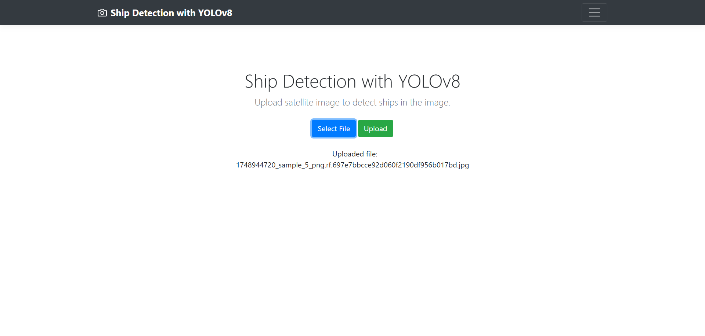
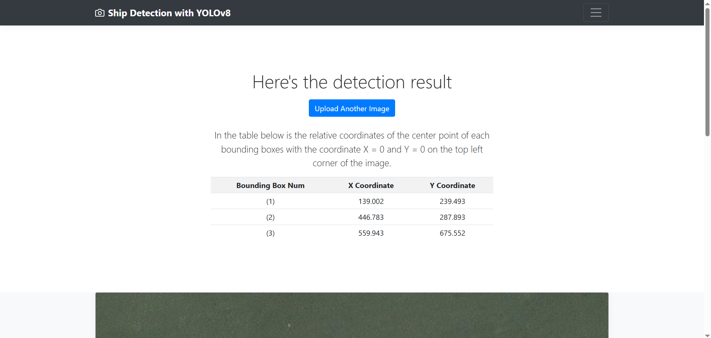
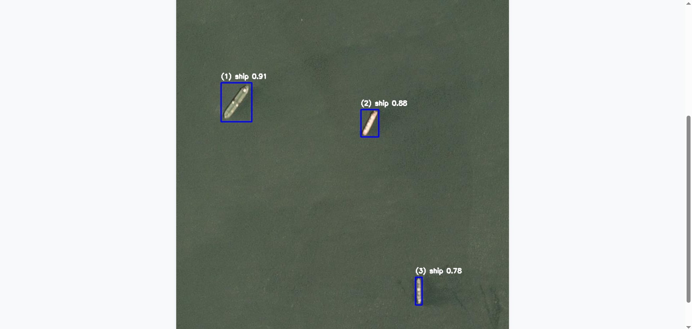

# Ship Detection with YOLOv8

A web-based application that allows users to upload images and detects ships using a YOLOv8 object detection model. Built as part of my undergraduate thesis to explore deep learning applications in maritime surveillance.

## Table of Contents

- [Demo](#demo)
- [Features](#features)
- [Tech Stack](#tech-stack)
- [Project Architecture](#project-architecture)
- [Flow](#flow)
- [Installation](#installation)
- [Model Details](#model-details)
- [Project Motivation](#project-motivation)
- [License](#license)

---

## Demo

> Here are some snapshots to demonstrate the project's functionality.

- **Image Upload Page**
  

- **Detection Result**
  
  

---

## Features

- Upload from any browser
- Performs ship detection using YOLOv8
- Displays annotated results with labeled bounding boxes and object coordinates
- Lightweight Flask backend
- Modular architecture for extensibility

---

## Tech stack

The project is structured in three main layers:

| Layer    | Technology                     |
|----------|--------------------------------|
| Frontend | HTML, CSS, Bootstrap           |
| Backend  | Python, Flask                  |
| Model    | Python, YOLOv8 (Ultralytics)   |

<details>
<summary>Show Tech Stack Badges</summary>

<br>

<table>
  <tr>
    <th>Layer</th>
    <th>Technology</th>
  </tr>
  <tr>
    <td>Frontend</td>
    <td>
      
      
      
    </td>
  </tr>
  <tr>
    <td>Backend</td>
    <td>
      
      
    </td>
  </tr>
  <tr>
    <td>Model</td>
    <td>
      
      
    </td>
  </tr>
</table>

</details>

---

## Project Architecture

The project follows a hybrid structure:

- **Frontend**: Static HTML pages styled with CSS and Bootstrap
- **Upload Handler**: PHP script (`upload_handler.php`) used to receive uploaded images and store them on the server
- **Backend API**: Flask server (`app.py`) processes the uploaded image using the YOLOv8 model and returns detection results

Below is the directory structure with key components:

```
YOLOv8ShipDetection/
├── api/
│   ├── app.py [Flask server to run YOLOv8 inference]
│   └── upload_handler.php [PHP script to handle image uploads from the frontend]
├── images/
│   ├── predict_result/ [Stores output images with bounding boxes]
│   └── uploads/ [Stores raw uploaded images]
├── pages/ [Contains folders of pages html files]
│   ├── confirm/
│   ├── result/
│   └── upload/
├── yolo_model/ [Contains the YOLOv8 model weights]
└── README.md
```

> Note: The frontend HTML files are served via a web server, and are not rendered by Flask. Only the API call is routed through Flask.

---

## Flow

Below is a diagram to show the project flow

```
Browser
   │
   ▼
[HTML Upload Page]
   │
   ▼ (form POST)
[PHP Upload Handler] ───► [Save to /uploads/]
                                 │
                                 ▼
                         [Flask API → YOLOv8]
                                 │
                                 ▼
                         [Save to /predict_result/]
                                 │
                                 ▼
                      [Browser Redirect to Result Page]

```

---

## Installation

This project must be deployed on a web server that supports both PHP and Python. A local setup using **XAMPP**, **LAMP**, or **WAMP** is recommended for development.

### 1. Requirements

- Python 3.8+
- PHP 7.x+
- Flask
- Web server environment (e.g., Apache via XAMPP/LAMP)

---

### 2. Setup Steps

1. **Clone the repository**:

    ```
    git clone https://github.com/yuveex/YOLOv8ShipDetection.git
    ```

2. **Move the project folder to your web server's root directory**.  
   For XAMPP, this is typically: `C:\xampp\htdocs\`

3. **Install Python dependencies**:

    ```bash
    cd YOLOv8ShipDetection/api
    pip install -r requirements.txt
    ```

4. **Start the Flask API**:

    ```
    python app.py
    ```

 By default, the Flask server will run at `http://localhost:5000`.

5. **Start your web server** (e.g., Apache via XAMPP).

6. **Open your browser** and go to:

    ```
    http://localhost/YOLOv8ShipDetection/pages/upload/index.html
    ```

 Use the upload form to submit an image. The server will:
 - Save the image via `upload_handler.php`
 - Call the Flask API for inference
 - Display the detection result on the result page

 > Note: Ensure both Apache (for HTML + PHP) and the Flask server are running simultaneously.

 ---

## Model Details

- Model: [YOLOv8 by Ultralytics](https://docs.ultralytics.com/models/yolov8/) (medium variant)
- Dataset: [Airbus Ship Detection Challenge](https://www.kaggle.com/competitions/airbus-ship-detection/data)
- Training Configuration:
  - Epochs: 50
  - Batch Size: 64
- Performance:
  - AP: 0.828
  - AR: 0.793
  - mAP@50: 0.841
  - mAP@50:95: 0.605

---

## Project Motivation

This project was developed as part of my undergraduate thesis to address challenges in automated ship detection using deep learning. The goal was to build an accessible, web-based tool that demonstrates the application of YOLOv8 to real-world maritime datasets.

---

## License
This project is licensed under the MIT License.

---